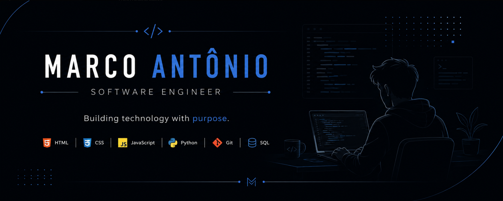

  

<h1 align="center">Marco Antônio Araújo Seibel</h1>

<h3 align="center">
Software Engineering Student • UniGuairacá
</h3>

Building technology with purpose.

---
## 👨‍💻 About Me

I am a Software Engineering student passionate about technology and continuous learning.

My goal is to build modern, efficient and intuitive software solutions while constantly improving my skills through practical projects.

Currently focused on Web Development, Python, Databases and Software Engineering.

## 🛠 Tech Stack

  

## 📚 Atualmente estudando

- 🌐 Desenvolvimento Web (HTML, CSS e JavaScript)
- 🐍 Programação com Python
- 🗄️ Banco de Dados e SQL
- 🔧 Git e GitHub
- 💻 Engenharia de Software

## 🎯 Objetivos

- Desenvolver aplicações web modernas e responsivas.
- Construir projetos que resolvam problemas reais.
- Evoluir continuamente como Desenvolvedor de Software.
- Criar um portfólio sólido através de projetos práticos.

## 🌎 Connect With Me

